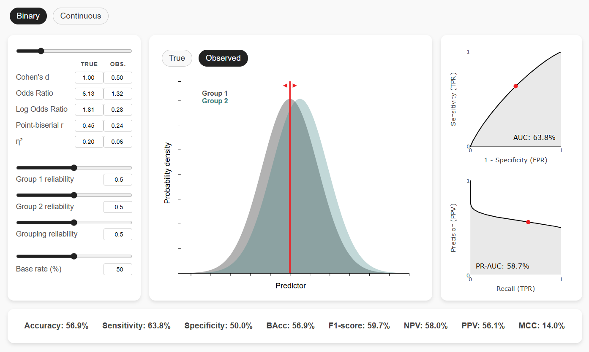

# E2P Simulator

An interactive web tool for simulating how statistical effect sizes translate into practical predictive utility, with adjustments for measurement reliability and base rates. 

**Try it out**: [https://povilaskarvelis.github.io/e2p-simulator](https://povilaskarvelis.github.io/e2p-simulator)

## Overview

This tool helps researchers understand the relationship between statistical effect sizes (like Cohen's d, correlation coefficients) and their practical predictive utility. It visually and quantitatively shows how measurement reliability and base rates limit predictive utility.

This tool is designed to facilitate:

1. Interpreting the potential impact of research findings 
2. Understanding the role that reliability and base rates play in developing predictive models
3. Planning studies and determining required effect sizes

## Analysis modes

E2P Simulator explores two scenarios:

- **Binary outcome measures (classification)**: Considers a scenario where the groups are naturally distinct (e.g., treatment vs. control, male vs. female). Adjusting the settings can help determine what effect size is needed to achieve the desired classification performance. Mahalanobis D calculator can then be used to estimate how many predictors of smaller effect sizes would need to be combined to achieve the needed group separation. In general, this helps understand both effect sizes and predictive performance in terms of group separation. 

- **Continuous outcome measures (prediction)**: Considers a scenario where the groups are formed after performing prediction/regression, through thresholding of the outcome variable (e.g., responders vs. non-responders, mental disorders vs. controls). This helps demonstrate inherent limitations in achieving high group separation when the groups are not categorically distinct. Adjusting the settings can help determine what level of correlation or explained variance is needed to achieve the desired classification performance. Multivariate R² calculator can then be used to estimate how many predictors of smaller correlations would need to be combined to achieve the needed level of R².

## Citation

If you use this simulator in your research, please cite:

Karvelis, P., & Diaconescu, A. O. (2025). E2P Simulator: Understanding predictive value of effect sizes - 
An interactive tool for exploring reliability and base rate effects. (TBC)

Zenodo?
JOSS?

