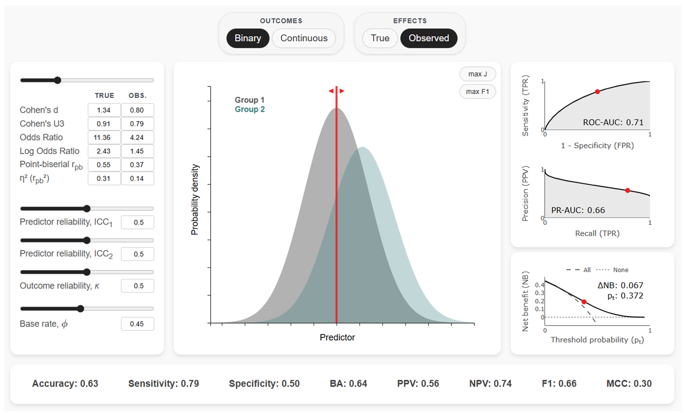

# E2P Simulator
[](https://doi.org/10.5281/zenodo.15127945)

E2P Simulator (Effect-to-Prediction Simulator) allows researchers to interactively and quantitatively explore the relationship between effect sizes (e.g., Cohen's d, Odds Ratio, Pearson's r), the corresponding predictive performance (e.g., ROC-AUC, Sensitivity, Specificity, Accuracy, etc.), as well as real-world predictive value and clinical utility (e.g., PPV, NPV, PR-AUC, Net Benefit, etc.) while explicitly accounting for measurement reliability and outcome base rates.

E2P Simulator has several applications:

1. **Interpretation of findings**: It helps researchers move beyond arbitrary "small/medium/large" effect size labels and misleading predictive metrics by grounding their interpretation in estimated real-world predictive utility.

2. **Research planning**: Being able to easily derive what effect sizes and predictive performance are needed to achieve a desired real-world predictive performance allows researchers to plan their studies more effectively and allocate resources more efficiently.

3. **Education**: The simulator's interactive design makes it a valuable teaching tool, helping researchers develop a more intuitive understanding of how different abstract statistical metrics relate to one another and to real-world utility.

This tool has been designed with biomedical and behavioral sciences in mind, particularly areas such as biomarker research and precision medicine/psychiatry. However, it may be just as useful for any area of research that focuses on individual differences and personalization of interventions, such as within education and sports sciences.

**Try it out**: [https://www.e2p-simulator.com](https://www.e2p-simulator.com)



## Citation

If you use this simulator in your research, please cite it as:

Povilas Karvelis. (2025). povilaskarvelis/e2p-simulator: E2P Simulator v1.2.0 (v1.2.0). Zenodo. https://doi.org/10.5281/zenodo.17112626

## Running E2P Simulator Locally

To run E2P Simulator on your local machine for development or testing purposes, follow these steps:

1. **Prerequisites**:
   - Make sure you have [Node.js](https://nodejs.org/) installed

2. **Clone the Repository**:
   ```
   git clone https://github.com/povilaskarvelis/e2p-simulator.git
   cd e2p-simulator
   ```

3. **Install Dependencies**:
   ```
   npm install
   ```

4. **Start the Local Server**:
   ```
   npm start
   ```

5. **Access the Simulator**:
   - Open your web browser and navigate to `http://localhost:8000`
   - The simulator should now be running locally on your machine

## Testing

Key functionalities can be verified by running end-to-end automated tests written with Cypress, `binary-tests.cy.js` and `continuous-tests.cy.js`:

   ```
   npm run test:binary 
   npm run test:continuous
   ```

The tests can also be run by opening the user interface and navigating to the tests:

   ```
   npm run test:open
   ```

## Contributing

Contributions to E2P Simulator are welcome! Please see the guidelines file `CONTRIBUTING.md` for more information.

## License

E2P Simulator is distributed under the MIT License. See the `LICENSE` file for more information.

